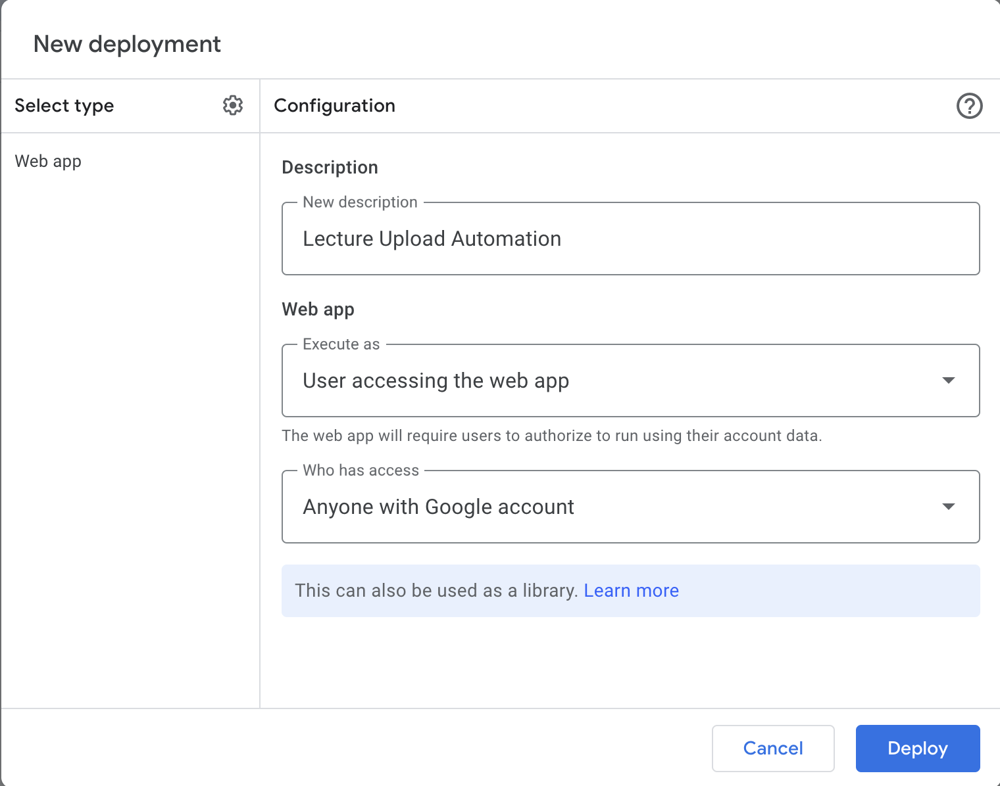

# Lecture Upload Automation

Once a new video is uploaded to a Youtube playlist,
1. Make a post/comment on Ed with video link
2. Create a GitHub pull request to course site repository to add lecture link

## How this works

### the trigger
#### 1. Detect when a video is uploaded to a playlist
Currently, Zapier is being used for this. Once a new video is detected, it makes a post to Slack with a link to the Google Apps script exec link.
See template here: https://zapier.com/shared/4ca17dd7830d9b918798ae8d1229d31574049004

Aside: This step could also be replaced with something else that polls and checks the Youtube playlist, but that requires a long-running script.
Or, have fun figuring out Youtube pub/sub API!

### the execution
Once someone clicks on the Google Apps script exec link, then script [appscript.js](appscript.js) is run. This script lives as a Google Apps Script Web App:

#### 2. Make a post/comment on Ed with video link
See the `postOnEd` function in the script

#### 3. Create a GitHub pull request to course site repository to add lecture link
See the `makeGithubPR` function in the script

-------
# Contact
made by Trinity Chung trinityc@berkeley.edu in Fall 2023

reach out to me if you have any questions!